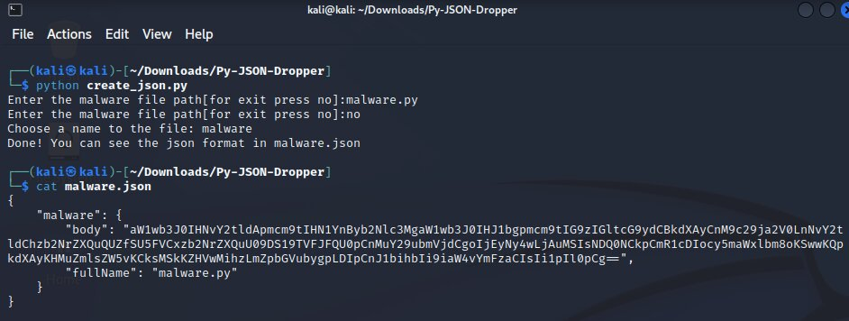
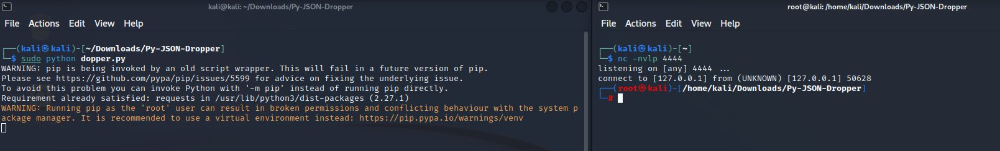

<h1 align="center">Py Json Dropper</h1>
The Py-JSON-Dropper is a POC for JSON-format dropper, and intended to make it easier to create and disseminate JSON-formatted malware droppers. A dropper is a little program created to install and run additional harmful malware on a target machine. The program aids in producing a JSON file that contains base64-encoded malware bodies and file names that can later be used to spread malware using API. After achiving the malware body from the API, it will use the file extention for choose the in memory execution type.


The POC is to demonstrate the option to build a dropper via JSON format and drop malware using the method, focusing on the concept of JSON dropper and less the execution process. Not for malicious uses.

<h2 align="center">Important Note</h2>
This tool is intended for educational and ethical purposes only. It is important to follow legal and ethical guidelines when using and distributing software. The unauthorized use of malware or any malicious activities is strictly prohibited and can have serious legal consequences.
This is the POC of the JSON format dropper for defense evasion.

<h2 align="center"">Features</h2>

The Py-JSON-Dropper features:
- Encode malware bodies into base64 and store them in a JSON format.
- Simple user interface for providing malware file paths.
- Creates a JSON file that includes the encoded malware bodies and file names.
- Check the extension type of the code for the execution.
- Execute the script via in-memory execution.

<h2 align="center"">Installation and Usage</h2>

<h3>Installation</h3>
To use this tool, make sure you have the required dependencies installed:

Note: It is not a must step, because there is an installation process in the dropper.

  ```shell
  pip install requests
  ```
  
<h3>Usage</h3>

To use this tool, will require the malware to be written in Bash, Power-Shell, Java, or Python.

- Run the creator.py script to create the JSON file:
  ```shell
  python3 create_json.py
  ```

- Enter the paths to your malware files by following the prompts. When you're finished, you'll be asked to give the JSON file a name. The malware's bodies and file names will be encoded in the final JSON file.
- Upload the JSON to the API editor or create a website API.
- Add this API URL to the dropper script.
- Run the dropper:
  ```shell
  sudo python3 dropper.py
  ```


Note: In the example, can see a reverse shell prcoess that run via the dropper(On linux machine).

<h2 align="center"">License</h2>

This project is licensed under the MIT License - see the [LICENSE](LICENSE) file for details.

<h2 align="center">Author</h2>

- [D0rDa4aN919](https://github.com/D0rDa4aN919)

<h2 align="center">Acknowledgments</h2>
The tool was developed to demonstrate how to produce and disseminate malware droppers in a controlled setting. It is not meant to support or facilitate any nefarious or unlawful activity.

- [JSON](https://developer.mozilla.org/en-US/docs/Learn/JavaScript/Objects/JSON)
- [Dropper](https://encyclopedia.kaspersky.com/glossary/trojan-droppers/)
- [RastFul API](https://docs.github.com/en/rest?apiVersion=2022-11-28)
